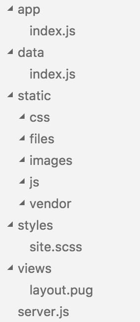

# Proto

Rapid prototyping with Pug, Sass, and CommonJS/Browserify, and LiveReload

## Usage

```sh
git clone https://github.com/barberboy/proto prototype
cd prototype
npm install
npm start
```

Then open <http://localhost:1844>.

## Editing

proto watches for changes in .html, .pug, .css, .scss, .js, .jpg, .png, .svg, .gif files and reloads the page on save.



## License

ISC
